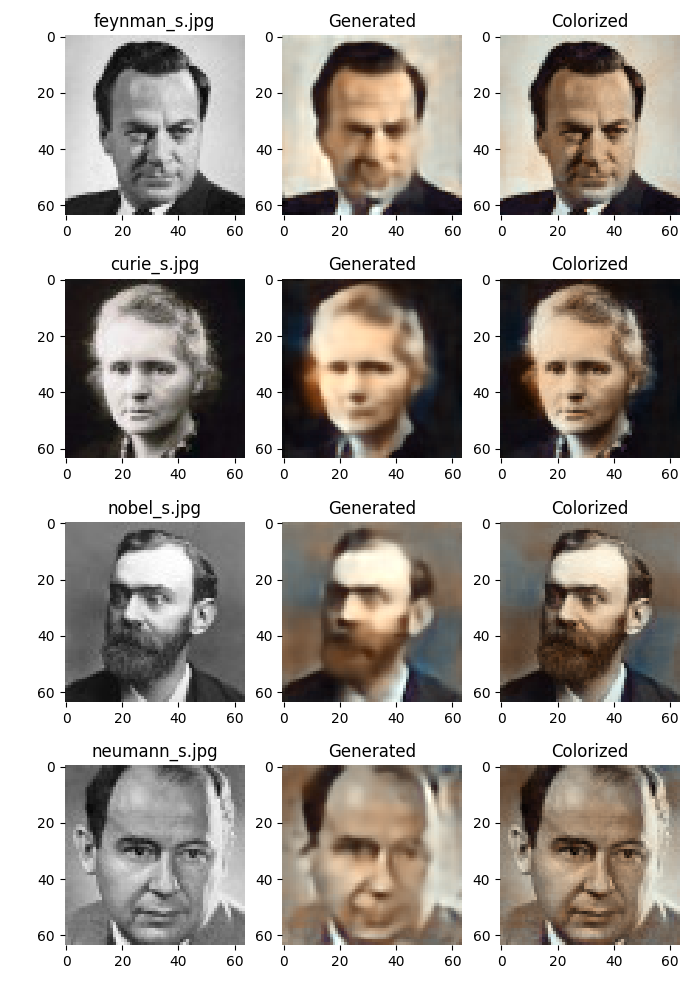

# colorize-faces
Tensorflow and keras based portrait colorizer. The script generates a new color-map from given gray-scale image and then by combining these generates a colorized version of the face.

I trained the network on 9k images of faces from the lfw dataset. http://vis-www.cs.umass.edu/lfw/

It currently works well on only portrait faces of real photographs, it does not work well for cartoons or non people. I have included some results below showing various portraits colorized. The third column shows the final combined image of the original gray-scale and the generated color-map. It uses a fairly deep convolutional neural network to generate the color map. I that the network could be simplified quite a lot given some time adjusting it.

